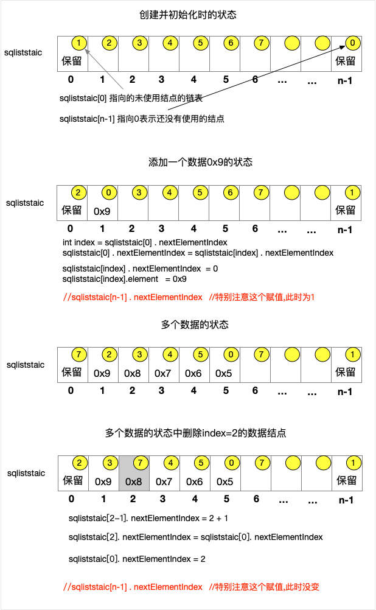
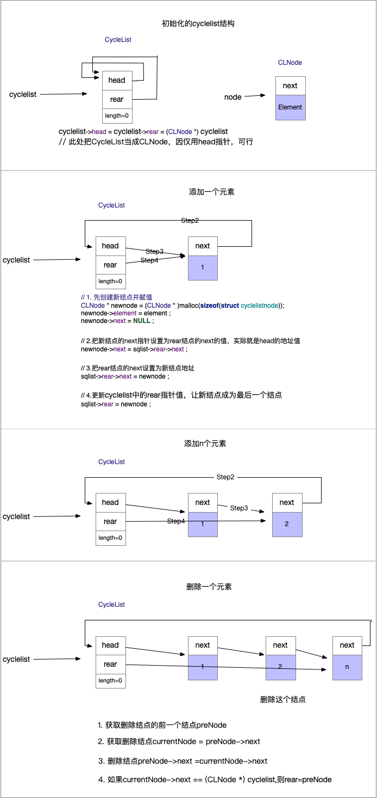

# 线性表

线性表：实现数据值之间一对一的线性关系的一种数据结构。定义为零个或多个相同特性值的有序集合，第一没有前驱，最后一个没有后继，其它均有前驱和后继数据值。


[TOC]

## 1. 线性表的实现

### 1.1 顺序实现--顺序表

>**关注点**
>
>1. 顺序表为 struct sqlist，别名SQList。它的组成部分。
>2. 对表的各种操作。一是实现，二是效率问题。
>3. 表的创建可以在栈上，也可以在堆上。根据需要选择。
>
>详情代码查看[source/LinearList](./source/LinearList/SequenceList.h)

```c
// 简化数据值的类型，直接使用int，让其关注点在数据结构上
typedef int ElementType ;//数据类型

#if FIXSIZE

// 固定大小的顺序链表，这样简化可以使关注点在其结构和操作中
#define MaxCapacity 10 //默认数组容量
// 顺序表--固定容量
typedef struct sqlist{
    int length;
    ElementType element[MaxCapacity];
}SQList ;

#else

#define DefaultCapacity 2 //默认数组容量
  // 顺序表——容量自动扩充，动态性
typedef struct sqlist{
    int capacity;
    int length;
    ElementType element[0]; // 或者可以声明为ElementType * element，这样就是一个指向数组的指针。
}SQList ;


#endif

// 对数据的操作
SQList * alloc_init();// 在堆上创建顺序表
bool  isEmpty(SQList * sqlist);//是否空
bool  isFull(SQList * sqlist);//是否满
bool update(SQList * sqlist , int atIndex,ElementType newElement);
bool del(SQList * sqlist , int atIndex);
bool getElement(SQList * sqlist,int atIndex,ElementType *element);
int search(SQList * sqlist,ElementType element);

// 因为结构不同，故有些方法的使用是不能一样的
#if FIXSIZE
bool add(SQList  * sqlist , ElementType element);
bool insertE(SQList  * list , int atIndex,ElementType newElement);
#else
bool add(SQList * * sqlist , ElementType element);// 此函数可能会改变表的内存，故需要传指针变量的地址
bool insertE(SQList * * sqlist , int atIndex,ElementType newElement);// 此函数可能会改变表的内存，故需要传指针变量的地址
#endif
```

**主要操作类型的效率问题**


| 顺序表-添加/插入 |  时间复杂度    |  备注 |
| ------------- | -------------|------------ |
|在任意位置add(int index,E e) | O(1)   | |
|在任意位置insert(int index,E e) | O(n)   | 需要移动index后面的所有结点 |
|------|------|------|
|~~在已知结点的后面~~  |  | index 直接加减 |
|~~在已知结点的前面~~ |  |index 直接加减|


|  顺序表-删除 |  时间复杂度    |  备注 |
| ------------- | -------------|------------ |
|在头部 delHead() | O(n) | 后面结点都想前移动 |
|在尾部  delTail()| O(1)   ||
|在任意位置del(int index) | O(n)   |平均情况下为O(n/2)=O(n)|
|------|------|------|
|~~已知结点的后面结点~~  |  | index 直接加减 |
|~~已知结点的前面结点~~ |  |index 直接加减|


| 顺序表-查找 |  时间复杂度    |  备注 |
| ------------- | -------------|------------ |
|任意位置get(int index) | O(1)  | |
|任意值contains(E e) | O(n)   | |
|------|------|------|
|~~已知结点的后面结点~~  |  | index 直接加减 |
|~~已知结点的前面结点~~ |  |index 直接加减|


### 1.2 链式实现--单链表

>**关注点**
>
>1. 线性链表的结构 struct  linkedlist，别名LinkedList。结点的结构struct  linkednode，别名Node。
>
>2. 对表的操作。一是实现，二是效率问题。
>
>3. LinkedList可以在栈或堆中创建。结点是在堆中。
>
>详情代码查看[source/LinearList](./source/LinearList/LinkedList.h)


```c
typedef  int ElementType  ;
// 表结点的结构
typedef  struct  linkednode{
     struct  linkednode * next;
     ElementType element;
} Node;
// 链式结构的表
typedef  struct  linkedlist{
    struct  linkednode * head;
    int length ;
}LinkedList;


// 对数据的操作
LinkedList * alloc_init_linked();// 在堆上创建顺序表
bool  isEmpty_linked(LinkedList * list);//是否空
//bool  isFull(LinkedList * list);//是否满栈 没有作用链表一般不会满
bool update_linked(LinkedList * list , int atIndex,ElementType newElement);
bool del_linked(LinkedList * list , int atIndex);
bool getElement_linked(LinkedList * list,int atIndex,ElementType *element);
int search_linked(LinkedList * list,ElementType element);

bool add_linked(LinkedList  * sqlist , ElementType element);
bool insert_linked(LinkedList  * list , ElementType element,ElementType newElement);
void  print(LinkedList  * list);
```

**主要操作类型的效率问题**


| 单链表-添加/插入 |  时间复杂度    |  备注 |
| ------------- | -------------|------------ |
|在头部 addHead(E e) | O(1) |  |
|在尾部  addTail(E e)| O(n)   |遍历找到尾结点|
|在任意位置add(int index,E e) | O(n)   |平均情况下为O(n/2)=O(n)|
|------|------|------|
|在已知结点的后面  | O(1) |  |
|在已知结点的前面 | O(n) |遍历找已知结点的前一个结点|


|  单链表-删除 |  时间复杂度    |  备注 |
| ------------- | -------------|------------ |
|在头部 delHead() | O(1) |  |
|在尾部  delTail()| O(n)   |遍历找到尾结点|
|在任意位置del(int index) | O(n)   |平均情况下为O(n/2)=O(n)|
|------|------|------|
|已知结点的后面结点  | O(1) |  |
|已知结点的前面结点 | O(n) |遍历找已知结点的前一个结点的前结点|


| 单链表-查找 |  时间复杂度    |  备注 |
| ------------- | -------------|------------ |
|任意位置get(int index) | O(n)   | |
|任意值contains(E e) | O(n)   | |
|------|------|------|
|已知结点的后面结点  | O(1) |  |
|已知结点的前面结点 | O(n) |遍历找已知结点的前一个结点|


### 1.3 线性表的各种扩展

#### 1.3.1 静态链表

> **注意点**
>
> 1. 它的实现思想实际是两条链的集合，一条指向已有数据元素链的第一个结点，另一条指向没有数据元素链的第一个结点。
> 2. 对数据的操作，注意listStatics[0]、listStatics[capacity-1]，及其每个元素中的nextElementIndex的值。

```c
// 顺序表--固定容量
typedef struct sqliststaic{
    int nextElementIndex;
    ElementType element;
}SQListStatic ;

// 声明一个表
const int capacity = 20;
SQListStatic  listStatics[capacity];
//listStatics[0] 指向所有未使用的结点的链的第一个
//listStatics[capacity-1] 指向已经使用元素的第一个结点
  
```
各种操作如下表



**主要操作类型的效率问题**

参考单链表。


#### 1.3.2 循环单链表

##### 1.3.2.1 数据结构与链表一样,操作一样，但具体实现有点细微差别。

```
typedef  int ElementType ;
typedef  struct cyclelistnode{
    struct cyclelistnode *   next ;
    ElementType element;
}CLNode;

typedef  struct cyclelist{
    CLNode * head ;
    int length;
}CycleList;

// 对数据的操作
CycleList * alloc_init_cycle_linked();// 在堆上创建顺序表
bool  isEmpty_cycle_linked(CycleList * list);//是否空
//bool  isFull(LinkedList * list);//是否满栈 没有作用链表一般不会满
bool update_cycle_linked(CycleList * list , int atIndex,ElementType newElement);
bool del_cycle_linked(CycleList * list , int atIndex);
bool getElement_cycle_linked(CycleList * list,int atIndex,ElementType *element);
int search_cycle_linked(CycleList * list,ElementType element);

bool add_cycle_linked(CycleList  * sqlist , ElementType element);
bool insert_cycle_linked(CycleList  * list , ElementType element,ElementType newElement);
void  print(CycleList  * list);
```

操作实现差别，举例如下:

```c
CycleList * alloc_init_cycle_linked(){
    CycleList * list = (CycleList *) malloc(sizeof(struct cyclelist));
    list->length = 0 ;
    list->head = (CLNode *)list ;// 指针指向自己(或者说是头指针)
}
bool  isEmpty_cycle_linked(CycleList * list){
    return  list->length == 0; // 也可以list.head == (CLNode *)list 
}

bool add_cycle_linked(CycleList  * sqlist , ElementType element){

    CLNode * newnode = (CLNode * )malloc(sizeof(struct cyclelistnode));
    newnode->element = element ;
    newnode->next = NULL ;

    CLNode *  head = (CLNode *)sqlist ;
    CLNode * current = head ;
  // 从头到尾遍历找到最后一个结点。时间复杂度O(n)
    while (current->next != head){
        current = current->next ;
    }
    newnode->next = head ;
    current = newnode ;
    sqlist->length += 1 ;

    return  true ;
}
```

##### 1.3.2.2 改进上面的结构，优化操作，提高效率
优化一般在时间和空间上相互妥协

```c
typedef  struct cyclelist{
    CLNode * head ;
    CLNode * rear ; //尾指针
    int length;
}CycleList;
// 此时在添加元素时，则不用遍历查找最后一个结点。
CycleList * alloc_init_cycle_linked(){
    CycleList * list = (CycleList *) malloc(sizeof(struct cyclelist));
    list->length = 0 ;
    // list->head = NULL ;不能设置成NULL，不利于后面代码的执行
    list->head = list->rear = (CLNode *)list ;// 头尾指针相等，且为头指针的地址
}
bool add_cycle_linked(CycleList  * sqlist , ElementType element){

    CLNode * newnode = (CLNode * )malloc(sizeof(struct cyclelistnode));
    newnode->element = element ;
    newnode->next = NULL ;
    // O(1)。
    newnode->next = sqlist->rear->next ;
    sqlist->rear->next = newnode ;
   
    sqlist->length += 1 ;
    return  true ;
}
```
图解一些操作




>从这小实例可以看出，数据的结构可以随意建立，只需要满足要求即可。但一个优秀的结构可以让操作更有效率。
>
>所以我们要选择或者创建合适的数据的结构。没有最好的，只有最合适的。


**主要操作类型的效率问题**


| 循环单链表-添加/插入 |  时间复杂度    |  备注 |
| ------------- | -------------|------------ |
|在头部 addHead(E e) | O(1) |  |
|在尾部  addTail(E e)| O(1)   ||
|在任意位置add(int index,E e) | O(n)   |遍历找到index-1的结点，然后操作|
|------|------|------|
|在已知结点的后面  | O(1) |  |
|在已知结点的前面 | O(n) |遍历找已知结点的前一个结点|


| 循环单链表-删除 |  时间复杂度    |  备注 |
| ------------- | -------------|------------ |
|在头部 delHead() | O(1) |  |
|在尾部  delTail()| O(1)   ||
|在任意位置del(int index) | O(n)   |平均情况下为O(n/2)=O(n)|
|------|------|------|
|已知结点的后面结点  | O(1) |  |
|已知结点的前面结点 | O(n) |遍历找已知结点的前一个结点的前结点|


| 循环单链表-查找 |  时间复杂度    |  备注 |
| ------------- | -------------|------------ |
|任意位置get(int index) | O(n)   | |
|任意值contains(E e) | O(n)   | |
|------|------|------|
|已知结点的后面结点  | O(1) |  |
|已知结点的前面结点 | O(n) |遍历找已知结点的前一个结点|


#### 1.3.3 双链表

双链接是在单链表的基础之上添加了指向前一个结点的列表。

```c
typedef  int ElementType ;

typedef struct  doublelinkedlistnode{
    struct  doublelinkedlistnode * next ;
    struct  doublelinkedlistnode * previous ;
    ElementType  element;
}DoubleListNode;

// 双向列表
typedef  struct  doublelinkedlist{
    DoubleListNode * head ;
    int length;
}DoubleListList;

// 双向循环列表，在双向链表上添加了一个尾指针,这样提高部分操作效率
typedef  struct  doublecyclelinkedlist{
    DoubleListNode * head ;
    DoubleListNode * rear ;
    int length;
}DoubleCycelListList;
```

**主要操作类型的效率问题**


| 双链表-添加/插入 |  时间复杂度    |  备注 |
| ------------- | -------------|------------ |
|在头部 addHead(E e) | O(1) |  |
|在尾部  addTail(E e)| O(n)  ||
|在任意位置add(int index,E e) | O(n)   |遍历找到index-1的结点，然后操作|
|------|------|------|
|在已知结点的后面  | O(1) |  |
|在已知结点的前面 | O(1) ||


| 双链表-删除 |  时间复杂度    |  备注 |
| ------------- | -------------|------------ |
|在头部 delHead() | O(1) |  |
|在尾部  delTail()| O(n)  ||
|在任意位置del(int index) | O(n)   |平均情况下为O(n/2)=O(n)|
|------|------|------|
|已知结点的后面结点  | O(1) |  |
|已知结点的前面结点 | O(1) ||


| 双链表-查找 |  时间复杂度    |  备注 |
| ------------- | -------------|------------ |
|任意位置get(int index) | O(n)   | |
|任意值contains(E e) | O(n)   | |
|------|------|------|
|~~已知结点的后面结点~~  |  |  |
|~~已知结点的前面结点~~ |  ||

#### 1.3.4 循环双链表

```c
// 双向循环列表，在双向链表上添加了一个尾指针,这样提高部分操作效率
typedef  struct  doublecyclelinkedlist{
    DoubleListNode * head ;
    DoubleListNode * rear ;
    int length;
}DoubleCycelListList;
```

**主要操作类型的效率问题**

参考循环单链表和双链表的操作

#### 1.3.5 顺序循环线性表

 参考一种循环队列的实现。

## 2. 线性表的应用

### 2.1 队列

队列：首先是一种线性表，其次只能在一端进行添加操作，另一端进行删除操作。

>
>
>

### 2.2 栈

队列：首先是一种线性表，其次只能同一端(表尾)进行添加、删除操作。

