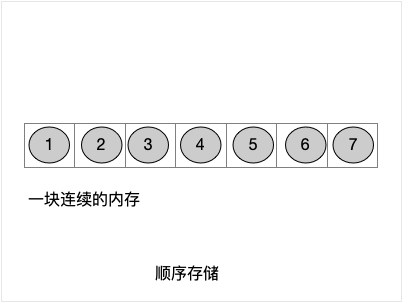

# computer_-science


[TOC]

# 总览

因GitHub不支持TOC等等一些markdown标记，推荐clone项目到本地，然后用Typora 软件来查看。效果比较好

## 1. 概述


## 2. 数据结构和算法

> 数据结构掌握三块知识：
>
> 1. 数据值(data values)  
> 2. 值之间的关系(relationships among them)
> 3. 数据的操作(operations applied to the data) 

**数据：**现实世界的事物在计算机中的符号表示(或者说是映射)。数据对象：性质相同的数据元素的集合，是数据的子集，大多时候简称数据。数据元素：数据的有意的基本单位。

**结构：**组成整体的各部分的搭配和安排。

**数据结构：**公式：数据结构 = 数据值(data values) + 值之间的关系(relationships among them) + 数据的操作(operations applied to the data) 。

> [Data structure - Wikipedia]
>
> In computer science, a *data structure* is a data organization, management, and storage format that enables efficient access and modification.(在计算机科学中，数据结构是一种能够进行有效访问和修改的数据组织、管理和存储格式。)
>
>  More precisely, a *data structure* is a collection of data values, the relationships among them, and the functions or operations that can be applied to the data(更准确地说，数据结构是数据值、它们之间的关系以及可应用于数据的函数或操作的集合)


**数据类型：**一组性质相同的值的集合及定义在集合上的一些操作的总称。公式： 数据类型 = 值集 + 值集上的操作 。数据类型有两类：原子类型(不可再分的基本类型)、结构类型(若干类型组合而成，可再分)

**算法：**解决特定问题*求解步骤*的描述。在计算机中为指令有限序列。算法有五个特性：输入输出、有穷、确定、可行性。设计算法三个要求：正确、可读、健壮、运行快空间少。

算法度量：运行时间度量+ 存储空间度量。时间度量中有最坏时间复杂度和平均时间复杂度，这两个比较常用。

**常见算法的时间复杂度:** O(1)<O(logn)<O(n)<O(nlogn)<O(n^2)<O(n^3)<O(2^n)<O(n!)


### 2.1 数据

#### 2.1.1 数据的表示

在计算机中表示一个数据，例如，表示一个人，有身高、体重、年龄等等。

在不同的语言环境中的语法各不相同，但是它们的底层所表示数据是一致。


在C中的表示一个人

```c
typedef struct Human {
    float hight ;
    float weight;
    int age;
}
```

在C++中的表示一个人

```C++
struct Human{
  public:
    float hight ;
    float weight ;
    int age;
}
或者
class Human{
   public:
    float hight ;
    float weight ;
    int age ;
}
```

在Objective-C中表示一个人

```objective-c
@interface Human : NSObject{
    float hight ;
    float weight ;
    int age ;
}
@implementation Human{
    float hight ;
    float weight ;
    int age ;
}
```

在Swift中的表示一个人

```swift
struct Human{
    var hight:Float = 0
    var weight:Float = 0
    var age:Int32 = 0
}
或者
class Human{
    var hight:Float = 0
    var weight:Float = 0
    var age:Int32 = 0
}
```

#### 2.1.2 数据的值

```C
在C中
struct Human human;//值在栈中

在C++中
Human human ;//值在栈中

在Objective-C中
Human * human = [Human alloc] init];//值在堆中，变量在栈中

在Swift中
var human = Human()//值在堆中，变量在栈中

```
它们所表示的数据的值，也就是Human的值在内存中是一致的。
```
   Human(每格4B)
  --------------   
  |  hight     |
  --------------
  |  weight    |
  --------------   
  |  age       |
  --------------

```

**所以在开发中，根据各自的情况选择合适的开发环境和合适的数据对象的表示。**


### 2.2 数据值之间的关系(结构)

**逻辑结构：**数据值之间的相互关系。它是面向问题的。

**物理结构：**数据的逻辑结构在内存中的存储形式。它是面向计算机的，逻辑结构最终需要存储在物理结构中。

#### 2.2.1四种逻辑关系(结构)

##### 2.2.1.1 值之间没关系的集合关系。


##### 2.2.1.2 值之间一对一的线性关系


这种数据结构的详情实现参见[线性表](./LinearList.md)


##### 2.2.1.3 值之间的一对多的树形关系


##### 2.2.1.4 值之间的一对多的图形关系


#### 2.2.2二种物理关系(结构)

##### 2.2.2.1 值之间是顺序结构:逻辑关系 == 物理关系

##### 2.2.2.2 值之间是链式结构:逻辑关系 != 物理关系


### 2.3 对数据的操作
#### 2.3.1 四类基本操作:增、删、改、查
#### 2.3.2 各种操作的效率问题--算法问题


## 3. 设计模式


## 4. 操作系统


## 5. 开发语言

#### 4.1 语言


#### 4.2 C


#### 4.3 C++


#### 4.4 Objective-C


#### 4.5 Swift


