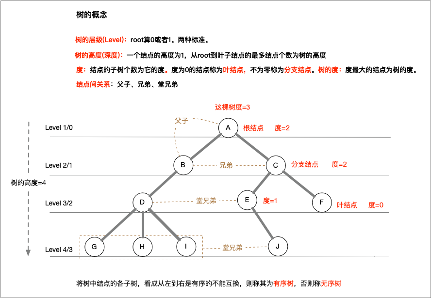
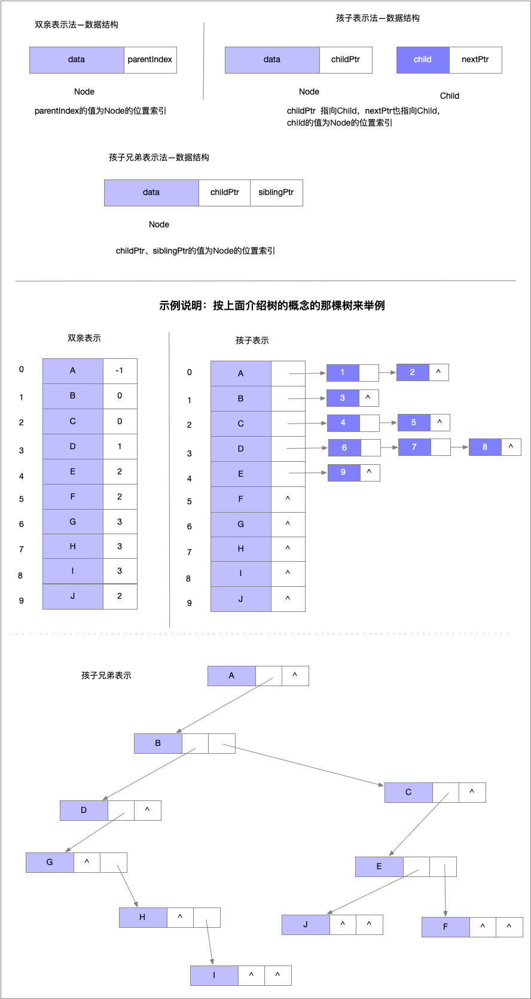

# 树

**定义：**n个结点的有限集合。n=0为空树。任何非空树有且仅有一个特定结点称为root。n>1时，其余结点可分为m>0个互不相交的有限集T1、T2、...Tm，其中每个集合本身又是一棵树，并称为root的子树。

[TOC]

## 1. 树的各种概念

> 1. **度**，树的度。
> 2. 树的高度或者称**深度**
> 3. 结点之间的关系
> 4. **有序树、无序树**
> 5. **森林：**n棵不相交树的集合为森林。





## 2. 树的实现方式

**树的三种表示法：**

1. 双亲表示法：a-存储结点本身，b-存储结点的双亲关系。
2. 孩子表示法：a-存储结点本身，b-存储结点的孩子关系。孩子结点都链起来。
3. 孩子兄弟法：a-存储结点本身，b-存储结点的第一个孩子和第一个兄弟(若存在)。**这种表示法可以生成一颗二叉树**。

>这几种表示法还可以结合起来使用，这需要根据实际情况来设计。

**三种表示法的数据结构和示例图**



## 3. 特殊的树：二叉树

定义：n结点的有限集合。该集合或为空集;或由root与两棵互不相交的、分别称为root的左、右子树的二叉树组成。

自己理解：一颗树且每个结点的孩子结点不超过2个(度不超过2)。

### 3.1 二叉树的特点和五个性质

#### 3.1.1 特点

> 1. 结点度不超过2
> 2. 左右子树有序
> 3. 二叉树有五种形态：空、一个根、根只有左子树、根只有右子树、根有左右子树。

#### 3.1.2 五个性质

1. **在第level i上至多有2^i个结点(i>=0)或者2^(i-1)个结点(i>=1)。**
2. **高度为h的二叉树，结点总数最多2^(h+1) -1(root高度为0)或者2^(h) -1 root高度为1。**
3. N个结点的最小可能高度或level是多少?N=2^(h+1) - 1 ,已知N求h值。*(rule2的变种)*
4. 有M个叶结点的二叉树，至少有多少level。*(rule1的变种)*
5. **满二叉树中叶结点总数比分支结点总数多一个。**

#### 3.1.3 特殊的二叉树

1. 斜树
2. 满二叉树(Full Binary Tree):每个结点有0或2个子结点。(或者分支结点都有2个结点)
3. 完全二叉树(Complete Binary Tree)： 每层结点都完全填满，在最后一层上如果不是满的，则只缺少右边的若干结点。
4. 完美二叉树(Perfect Binary Tree)： 每层结点都完全填满。

### 3.2 二叉树的存储

>
>1. 顺序存储只合适完全二叉树。
>2. 链式存储的实现：数据域和指向左右两个子树的指针域。
>
>

链式实现的二叉树的数据结构

```c
typedef  int ElementType ;

typedef struct treenode{
    struct treenode * lnode ; // 指向左子树
    struct treenode * right ;//指向右子树
    ElementType elements;
}TreeNode;
```

#### 3.2.1 二叉树的操作--遍历和生成

**四种遍历方式：**

1. 顺序遍历(Left, Root, Right)
2. 前序遍历(Root, Left, Right)
3. 后序遍历(Left, Right, Root)
4. 层序遍历(从root开始一层层从左到右遍历)

**根据序列生成树：**

只能根据顺序和前序(或者后序)才可以确定一棵树。

根据扩展化的序列来生成一棵树(AB#D##C##),也就是一个满二叉树序列，不存在的结点用''#''代替

#### 3.2.2 二叉树的线索化

**n个结点的二叉树有2n个指针域，而用到了n-1个(n个结点全部链接起来有n-1条线)，空的指针域有n+1个。我们把它们利用起来，让其指向结点的前驱和后继，线索化这课二叉树，也叫线索二叉树。**

线索二叉树的数据结构


线索二叉树的线索化的过程


#### 3.2.3 树、森林和二叉树的相互转化
树转二叉树：1. (兄弟间)**加线** 2. (除左孩子)**去线** 3. (树)**调整层次**
二叉树转树:   1. (父节点和所有其左孩子的n个右孩子)**加线** 2. (兄弟间)**去线** 3. (树)**调整层次**

森林转二叉树: 1. 先把所有单棵树转为二叉树  2. 然后把后面的树添加为前面一棵树的右子树。
二叉树转森林: 1. 先把根结点的右子树断开，再把右子树的右子树断开，直到没有。2. 把每棵二叉树树转为树。

#### 3.2.4 树、森林的访问
**树有两种遍历：**
先根遍历-->对应二叉树的前序遍历
后根遍历-->对应二叉树的顺序遍历(中根遍历)

**森林有两种遍历:**
前序遍历-->对应二叉树的前序遍历
后序遍历-->对应二叉树的顺序遍历(中根遍历)

## 4. 树或二叉树的常见应用

### 4.1 赫夫曼编码和树
路径:从树种一个结点到另一个结点之间的连线。
路径长度：路径上的连线数目。
树的路径长度，从根结点到每个结点的路径长度之和。


>1. 赫夫曼树(最优二叉树)：带权路径长度WPL最小的二叉树。为解决远距离通信的数据优化而产生。
>2. 构造赫夫曼树：a-选带权最小的结点构成新树，新树权为两结点权之和；从集合中删除两结点，然后添加新树结点。b-从新执行a。
>3. 赫夫曼编码：赫夫曼树的左分支代码0，右分支代表1，这样从根结点到叶结点的0、1分支序列为对应的字符编码。

